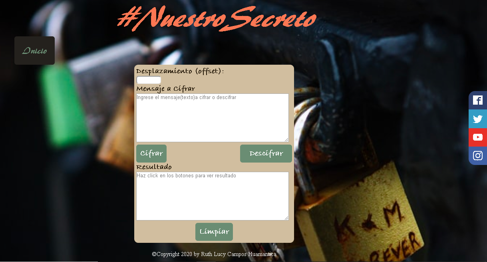

# CAESAR CIPHER-#NUESTROSECRETO

## 1. RESUMEN DEL PROYECTO

El cifrado César #NuestroSecreto es una aplicación web que ayuda guardar secretos
a muchas parejas que no quieren que terceras personas se enteren de su hermosa
relación, para ello lo único que el usuario realiza es ingresar el offset(desplazamiento),
luego el mensaje que desea descifrar o cifrar y con tan solo hacer click en cualquiera de los
botones ya tienes ¡Listo! tu mensaje cifrado o descifrado y puedes enviar por cualquiera
de las redes sociales que se ubican a lado derecho de la página (ingresa haciendo un click).

Otras cosas que puedes hacer con #NuestroSecreto es:

* Crear claves seguras para el email.
* Encriptar/cifrar una tarjeta de crédito.
* Tener tu diario digital.

## 2. IMAGEN FINAL DEL PROYECTO
### PANTALLA PRINCIPAL

### CIFRADO Y DESCIFRADO

## 3. INVESTIGACIÓN UX
### 3.1 USUARIO:
#NuestroSecreto está dirigido para público en general, primordialmente para parejas que desean cifrar o descifrar un mensaje y de esta manera tengan mayor seguridad y confidencialidad en comunicarse. También esta aplicación web puedes utilizar para crear una contraseña segura, tener un diario personal digitalizado cosa que cuando alguien quiera "husmear" no logre descubrir tus secretos :).

### 3.2 SOLUCIÓN:
Cuando quieres mantener una relación a escondidas, es decir que no quieres que terceras personas se enteren y no sabes cómo comunicarte en secreto?... Pues ¡¡aquí!! la solución --> #NuestroSecreto te ayuda a tener mensajes súper confidenciales y seguros.

### 3.3 PRIMER PROTOTIPO

### 3.4 Feedback
- Cambiar el color del diseño en los botones el fondo del cuadro de texto.
- Darle más vida a la página web.
- Empezar la codificación planificando, con obejtivos a corto plazo que sean fácil de poder cumplirlas.
- Utilizar Trello y cumplirlas.

### 3.5 PROTOTIPO FINAL

## 4. OBJETIVOS DE APRENDIZAJE
## UX
[/] Diseñar la aplicación pensando y entendiendo al usuario.

[/] Crear prototipos para obtener feedback e iterar.

[ ] Aplicar los principios de diseño visual.

## HTML y CSS
[/] Uso correcto de HTML semántico.

[/] Uso de selectores de CSS.

[/] Construir tu aplicación respetando el diseño realizado (maquetación).

## DOM
[/] Uso de selectores de nodos del DOM.

[/] Manejo de eventos del DOM.

[/] Manipulación dinámica del DOM.

## Javascript
[/] Manipulación de strings.

[/] Uso de condicionales.

[/] Uso de bucles.

[/] Uso de funciones.

[ ] Datos atómicos y estructurados.

[ ] Utilizar ES Modules (import | export).

## Testing
[ ] Testeo de tus funciones.

## Git y GitHub
[/] Comandos de git (add | commit | pull | status | push).

[/] Manejo de repositorios de GitHub (clone | fork | gh-pages).